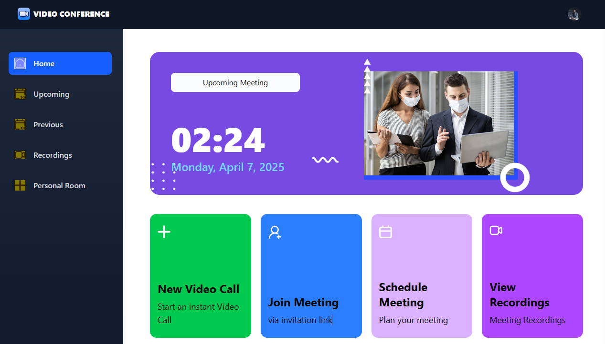
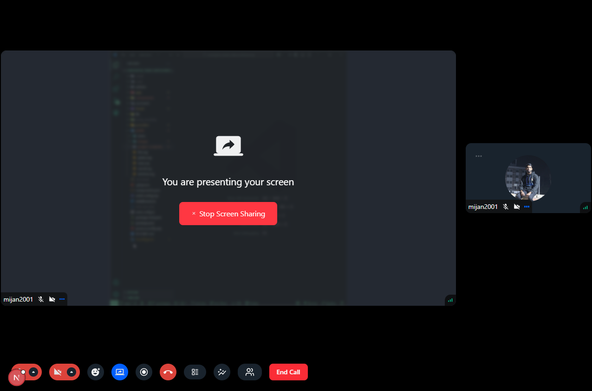
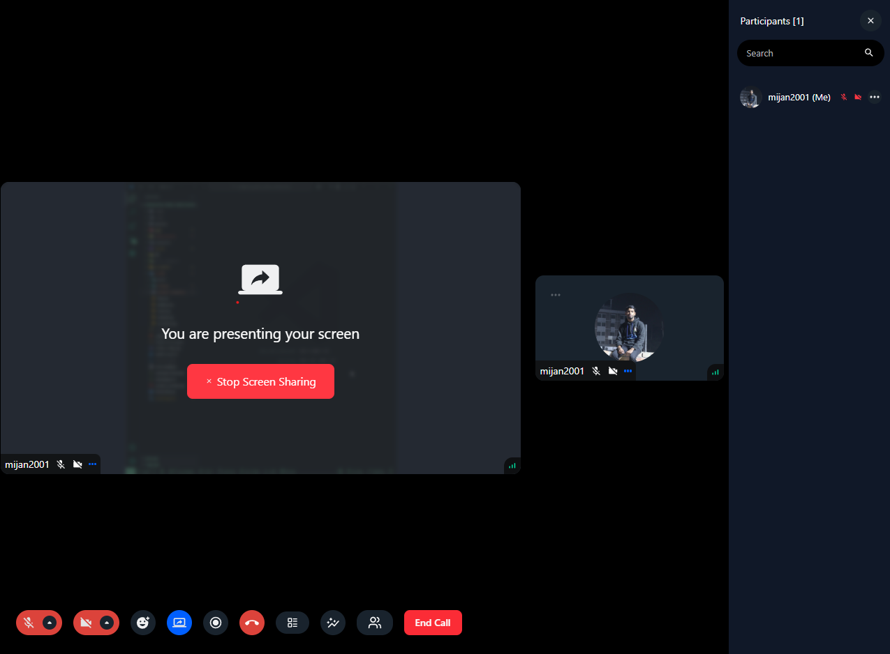
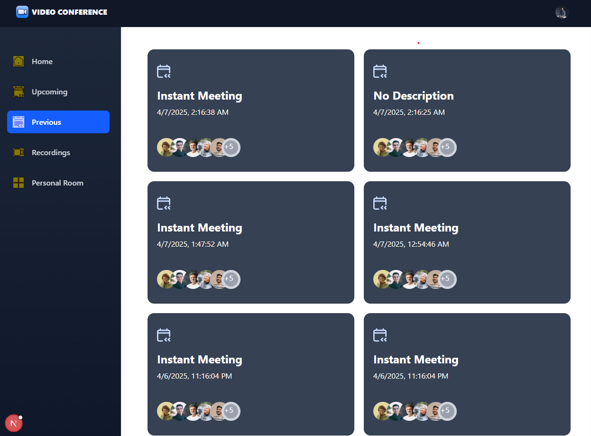

**Video Conference Website**

A professional video conferencing platform built with the latest Next.js 15 and TypeScript, integrating powerful features like real-time communication, meeting management, screen sharing, and recording — all wrapped in a sleek, responsive UI.

### Home Page



### Meeting Room



### Schedule Meeting



### Recorded Meetings



📌 Introduction
This project provides a secure and seamless video meeting experience. Users can log in, create or join meetings, and access essential functionalities like:

🔐 Secure authentication via Clerk

📅 Meeting scheduling

🎥 Video/audio management

📺 Screen sharing

📂 Meeting history & recordings

🧑‍🤝‍🧑 Participant management

🔁 Real-time interaction

## ⚙️ Tech Stack

| Technology       | Description                              |
| ---------------- | ---------------------------------------- |
| **Next.js**      | Full-stack React framework               |
| **TypeScript**   | Typed JavaScript for better code quality |
| **Clerk**        | Authentication and user management       |
| **getstream**    | Real-time video SDK                      |
| **shadcn/ui**    | Beautiful and accessible UI components   |
| **Tailwind CSS** | Utility-first CSS for rapid styling      |

## 🚀 Features

### 🔐 Authentication

-   Secure login powered by **Clerk**, supporting social logins and email/password.
-   Enforces user access levels for all functionalities.

### 🆕 New Meeting

-   Start a meeting instantly with pre-join configuration for camera and microphone.

### 🎛️ Meeting Controls

-   Comprehensive meeting management with features like:
    -   🔴 Start/stop recording
    -   📺 Screen sharing
    -   🤫 Mute/unmute
    -   🎉 Emoji reactions
    -   🔊 Sound adjustments
    -   🧑‍🤝‍🧑 Grid view & participant list
    -   📌 Pin/unpin participants
    -   ✋ Manage user permissions (block/unblock, allow screen share)
    -   🏃 Exit or end meeting for all participants

### 📆 Schedule Future Meetings

-   Plan meetings in advance with date and time.
-   View scheduled meetings under “Upcoming Meetings” for quick access and sharing.

### 🕓 Past Meetings List

-   Access a detailed list of all previous meetings with metadata.

### 🎞️ View Recorded Meetings

-   Rewatch recorded sessions anytime from the recordings archive.

### 🧑‍💻 Personal Room

-   Each user has a dedicated personal meeting room with a shareable link for quick calls.

### 🔗 Join via Link

-   Join meetings instantly using a valid meeting link.

### 🔐 Secure & Real-time

-   Built on **Stream's real-time SDKs** for private, fast, and secure communication.

### 📱 Responsive Design

-   Optimized for mobile, tablet, and desktop with a sleek, responsive layout.

## 📥 Clone the Repository

Run the following commands in your terminal to clone the repository and navigate into the project directory:

```bash
git clone https://github.com/Mijan2001/CodeAlpha_Task4_VideoConferencing.git
cd video-conference-app
```

---

## 📦 Install Dependencies

Install all required dependencies by running:

```bash
npm install
```

---

## 🛠️ Set Up Environment Variables

Create a `.env` file in the root directory of your project and add the following environment variables:

```env
NEXT_PUBLIC_CLERK_PUBLISHABLE_KEY=
CLERK_SECRET_KEY=

NEXT_PUBLIC_CLERK_SIGN_IN_URL=/sign-in
NEXT_PUBLIC_CLERK_SIGN_UP_URL=/sign-up

NEXT_PUBLIC_STREAM_API_KEY=
STREAM_SECRET_KEY=
```

Replace the placeholders with your actual API keys and configuration values.

---
